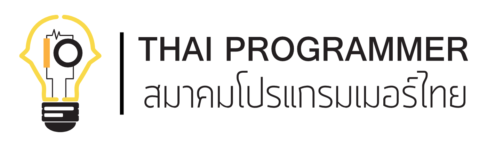

<p align="center">
  
  <h2 align="center"><a href="https://roadmap.thaiprogrammer.org">roadmap.thaiprogrammer.org</a></h2>
  <p align="center">Community driven roadmaps, articles and resources for developers in Thailand<p>
  <p align="center">This Repository inspired by Roadmap.sh with Thai content<p>
  <p align="center">Original content <a href="https://roadmap.sh">Roadmap.sh</a><p>
  <p align="center">
    <a href="https://roadmap.thaiprogrammer.org/">
    	
    </a>
    <a href="https://roadmap.thaiprogrammer.org/best-practices">
    	
    </a>
    <a href="https://roadmap.thaiprogrammer.org/questions">
    	
    </a>
    <a href="https://www.youtube.com/channel/UCA0H2KIWgWTwpTFjSxp0now?sub_confirmation=1">
    	
    </a>
  </p>
</p>

<br>


Roadmaps are now interactive, you can click the nodes to read more about the topics.

### [View all Roadmaps](https://roadmap.thaiprogrammer.org) &nbsp;&middot;&nbsp; [Best Practices](https://roadmap.thaiprogrammer.org/best-practices) &nbsp;&middot;&nbsp; [Questions](https://roadmap.thaiprogrammer.org/questions)


Here is the list of available roadmaps with more being actively worked upon.

- [Frontend Roadmap](https://roadmap.thaiprogrammer.org/frontend) / [Frontend Beginner Roadmap](https://roadmap.thaiprogrammer.org/frontend?r=frontend-beginner)
- [Backend Roadmap](https://roadmap.thaiprogrammer.org/backend)
- [DevOps Roadmap](https://roadmap.thaiprogrammer.org/devops) / [DevOps Beginner Roadmap](https://roadmap.thaiprogrammer.org/devops?r=devops-beginner)
- [Full Stack Roadmap](https://roadmap.thaiprogrammer.org/full-stack)
- [Computer Science Roadmap](https://roadmap.thaiprogrammer.org/computer-science)
- [AI and Data Scientist Roadmap](https://roadmap.thaiprogrammer.org/ai-data-scientist)
- [QA Roadmap](https://roadmap.thaiprogrammer.org/qa)
- [Python Roadmap](https://roadmap.thaiprogrammer.org/python)
- [Software Architect Roadmap](https://roadmap.thaiprogrammer.org/software-architect)
- [Game Developer Roadmap](https://roadmap.thaiprogrammer.org/game-developer) / [Server Side Game Developer](https://roadmap.thaiprogrammer.org/server-side-game-developer)
- [Software Design and Architecture Roadmap](https://roadmap.thaiprogrammer.org/software-design-architecture)
- [JavaScript Roadmap](https://roadmap.thaiprogrammer.org/javascript)
- [TypeScript Roadmap](https://roadmap.thaiprogrammer.org/typescript)
- [C++ Roadmap](https://roadmap.thaiprogrammer.org/cpp)
- [React Roadmap](https://roadmap.thaiprogrammer.org/react)
- [React Native Roadmap](https://roadmap.thaiprogrammer.org/react-native)
- [Vue Roadmap](https://roadmap.thaiprogrammer.org/vue)
- [Angular Roadmap](https://roadmap.thaiprogrammer.org/angular)
- [Node.js Roadmap](https://roadmap.thaiprogrammer.org/nodejs)
- [GraphQL Roadmap](https://roadmap.thaiprogrammer.org/graphql)
- [Android Roadmap](https://roadmap.thaiprogrammer.org/android)
- [Flutter Roadmap](https://roadmap.thaiprogrammer.org/flutter)
- [Go Roadmap](https://roadmap.thaiprogrammer.org/golang)
- [Rust Roadmap](https://roadmap.thaiprogrammer.org/rust)
- [Java Roadmap](https://roadmap.thaiprogrammer.org/java)
- [Spring Boot Roadmap](https://roadmap.thaiprogrammer.org/spring-boot)
- [Design System Roadmap](https://roadmap.thaiprogrammer.org/design-system)
- [PostgreSQL Roadmap](https://roadmap.thaiprogrammer.org/postgresql-dba)
- [SQL Roadmap](https://roadmap.thaiprogrammer.org/sql)
- [Blockchain Roadmap](https://roadmap.thaiprogrammer.org/blockchain)
- [ASP.NET Core Roadmap](https://roadmap.thaiprogrammer.org/aspnet-core)
- [System Design Roadmap](https://roadmap.thaiprogrammer.org/system-design)
- [Kubernetes Roadmap](https://roadmap.thaiprogrammer.org/kubernetes)
- [Cyber Security Roadmap](https://roadmap.thaiprogrammer.org/cyber-security)
- [MongoDB Roadmap](https://roadmap.thaiprogrammer.org/mongodb)
- [UX Design Roadmap](https://roadmap.thaiprogrammer.org/ux-design)
- [Docker Roadmap](https://roadmap.thaiprogrammer.org/docker)
- [Prompt Engineering Roadmap](https://roadmap.thaiprogrammer.org/prompt-engineering)
- [Technical Writer Roadmap](https://roadmap.thaiprogrammer.org/technical-writer)

There are also interactive best practices:

- [Code Review Best Practices](https://roadmap.thaiprogrammer.org/best-practices/code-review)
- [Frontend Performance Best Practices](https://roadmap.thaiprogrammer.org/best-practices/frontend-performance)
- [API Security Best Practices](https://roadmap.thaiprogrammer.org/best-practices/api-security)
- [AWS Best Practices](https://roadmap.thaiprogrammer.org/best-practices/aws)

..and questions to help you test, rate and improve your knowledge

- [JavaScript Questions](https://roadmap.thaiprogrammer.org/questions/javascript)
- [React Questions](https://roadmap.thaiprogrammer.org/questions/react)


## Share with the community

Please consider sharing a post about [roadmap.thaiprogrammer.org](https://roadmap.thaiprogrammer.org) and the value it provides. It really does help!

[](https://reddit.com/submit?url=https://roadmap.thaiprogrammer.org&title=Interactive%20roadmaps,%20guides%20and%20other%20educational%20content%20for%20Developers)
[](https://news.ycombinator.com/submitlink?u=https://roadmap.thaiprogrammer.org)
[](https://twitter.com/share?url=https://roadmap.thaiprogrammer.org&text=Interactive%20roadmaps,%20guides%20and%20other%20educational%20content%20for%20Developers)
[](https://www.facebook.com/sharer/sharer.php?u=https://roadmap.thaiprogrammer.org)
[](https://www.linkedin.com/shareArticle?url=https://roadmap.thaiprogrammer.org&title=Interactive%20roadmaps,%20guides%20and%20other%20educational%20content%20for%20Developers)

## Development

Clone the repository, install the dependencies and start the application

```bash
git clone git@github.com:ThaiProgrammer/tpa-roadmap.git
npm install
npm run dev
```

Note: use the `depth` parameter to reduce the clone size and speed up the clone.

```sh
git clone --depth=1 https://github.com/ThaiProgrammer/tpa-roadmap.git
```

## Contribution

> Have a look at [contribution docs](./contributing.md) for how to update any of the roadmaps

- Add content to roadmaps
- Add new roadmaps
- Suggest changes to existing roadmaps
- Discuss ideas in issues
- Spread the word

## Thanks to all contributors ❤

<a href="https://github.com/ThaiProgrammer/tpa/graphs/contributors">
  
</a>

Made with [contrib.rocks](https://contrib.rocks).

## License

Have a look at the [license file](./license) for details
